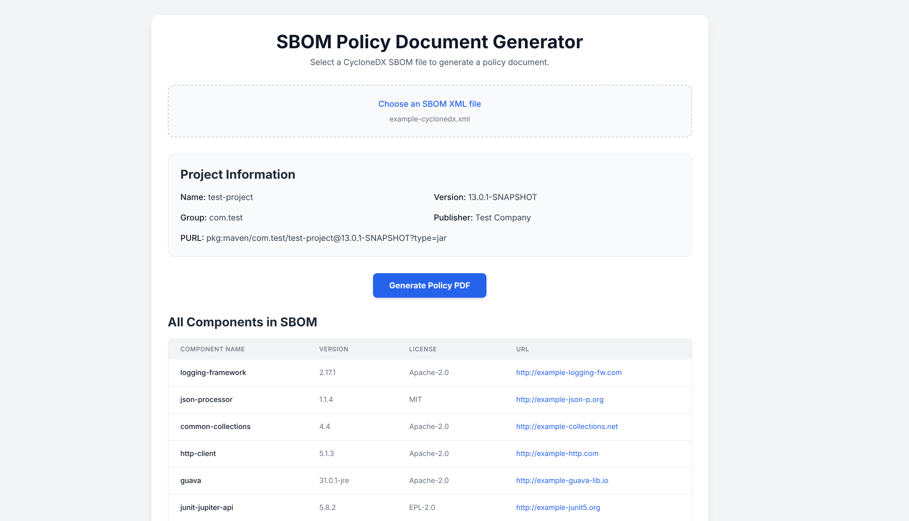

# bom2pdf
A tool to take cyclonedx xml bom files and put them in PDF format

# Usage

1. Open cyclonedx2pdf in a browser
   
3. Select the file you want to convert
   
5. Click the generate button to receive your PDF
